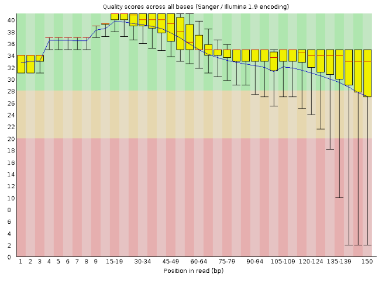

# HTS CNV Analysis Pipeline

[](https://www.nextflow.io)
[](conda/cnv.yml)
[](LICENSE)

A bioinformatics pipeline for detecting Copy Number Variations (CNVs) from paired-end High-Throughput Sequencing (HTS) data.

## Introduction

CNV genotyping refers to identifying and quantifying variations in the number of copies of particular regions in the genome, which can affect gene dosage and contribute to phenotypic diversity or disease. This pipeline automates the process of analysing raw FASTQ files to identify and call CNVs. It performs quality control, adapter trimming, alignment, and variant calling using a suite of standard bioinformatics tools. The primary objective of this project is to construct a modular CNV analysis workflow using short-read sequencing data generated by Illumina to ensure precise and comprehensive detection of CNVs. The entire workflow is built using [Nextflow](https://www.nextflow.io), a powerful and scalable workflow management system. It was demonstrated using the Whole Genome Sequence of *Escherichia coli*, and it was part of our course requirement. We demonstrated key stages such as read preprocessing, genome alignment, CNV detection, and result visualisation. It aims to deliver a highly adaptable and scalable workflow for genotyping CNVs not only in *E. coli* but also in other species, ensuring broad utility in genomic studies.

## Setting Up Your Work Environment
> This project was demonstrated on a Linux system.

Throughout this project, we'll use various bioinformatics tools, which will be installed using [conda](https://conda.io/docs/).

## Installation & Setup

First, clone the GitHub repository in your home folder and set up the working and data directories:
```bash
cd
git clone https://github.com/Bioinformatics-courses/HTS_2024_copy_number-genotyping.git
mv HTS_2024_copy_number-genotyping project
cd project
mkdir -p data/{raw, reference}
```

> **CODE BREAKDOWN**
> 
> - **`cd`** - Changes to the `$HOME` directory (if not already there).
> - **`git clone`** - Clones the GitHub repository provided into the current directory.
> - **`mv HTS_2024_copy_number-genotyping project`** - Renames the cloned directory to "project" (this directory will serve as the main working directory for the project).
> - **`cd project`** - Changes to the "cnv_genotyping" directory.
> - **`mkdir -p data/{raw, reference}`** - Creates the directories `data/raw` and `data/reference` where we will store the raw sequencing files (e.g., FASTQ files) and reference genome files, respectively.
> 
Next, create the conda environment from the YAML file provided in the `env` folder and activate the environment:
```bash
conda env create -f env/cnv.yml
conda activate CNV
```

> **NOTE:** This setup will ensure all the necessary tools and dependencies for the CNV genotyping pipeline are installed and ready for use.

## The Data
The datasets used for this CNV genotyping pipeline are Whole Genome Sequences (WGS) of *Escherichia coli*. We will be working with paired-end short-read data generated by Illumina sequencing technology. These datasets are sourced from multiple biological samples and will be used for CNV analysis.

The data consists of three paired-end sequencing runs with the following accession numbers:
- Paired-end ILLUMINA short reads for sample 1: [SRR2584863_1](https://www.ncbi.nlm.nih.gov/sra/SRR2584863) and [SRR2584863_2](https://www.ncbi.nlm.nih.gov/sra/SRR2584863)
- Paired-end ILLUMINA short reads for sample 2: [SRR2584866_1](https://www.ncbi.nlm.nih.gov/sra/SRR2584866) and [SRR2584866_2](https://www.ncbi.nlm.nih.gov/sra/SRR2584866)
- Paired-end ILLUMINA short reads for sample 3: [SRR2589044_1](https://www.ncbi.nlm.nih.gov/sra/SRR2589044) and [SRR2589044_2](https://www.ncbi.nlm.nih.gov/sra/SRR2589044)

These datasets can be sourced from the links provided above but can also be downloaded directly using the `sra-toolkit`:
```bash
sudo apt-get install sra-toolkit
prefetch SRR2584863 SRR2584866 SRR2589044 -O data/
fasterq-dump data/SRR2584863 --outdir data/raw
fasterq-dump data/SRR2584866 --outdir data/raw
fasterq-dump data/SRR2589044 --outdir data/raw
```

Upon completion, you will have the following files in the `data/raw` subdirectory of the working directory:
- `SRR2584863_1.fastq` and `SRR2584863_2.fastq` for sample 1,
- `SRR2584866_1.fastq` and `SRR2584866_2.fastq` for sample 2,
- `SRR2589044_1.fastq` and `SRR2589044_2.fastq` for sample 3.

These files will be used as the input data for the CNV genotyping pipeline.

## Quality Check
The first script we'll execute in this CNV genotyping pipeline is `quality_check.sh`. This script runs FastQC on the raw FASTQ files in the `data/raw` directory and generates quality reports. It also uses MultiQC to aggregate the FastQC reports for the paired-end reads.

```bash
cd scripts
sudo chmod +x fastqc.sh multiqc.sh
./fastqc.sh
./multiqc.sh
```

> **CODE BREAKDOWN**
> 
> - **`cd scripts`** - Navigates to the scripts directory.
> - **`sudo chmod +x quality_check.sh`** - Grants execute permission to the script.
> - **`./quality_check.sh`** - Executes the script.

### Script Functionality
Looking into the script (which is well-commented), it first sets up the necessary working directories and creates the `quality_check_reports/` output directory. It then loops over the FASTQ files in `data/raw` and runs FastQC on each. The script aggregates the FastQC reports for the paired-end reads using MultiQC to view the data quality comprehensively.

### Visualising the Output
After running the quality check, let's examine the results.

- The FastQC report of one of the paired-end reads (e.g., `cnv_genotyping/quality_check_reports/fastqc_output/SRR2584863_1_fastqc.html`) shows high per-base sequence quality, with median quality scores consistently above 30, ensuring the reads are suitable for downstream analysis.
  
  <center></center>

- Similarly, the MultiQC report for the paired-end reads (e.g., `cnv_genotyping/quality_check_reports/multiqc_output/multiqc_report.html`) shows consistent quality across all samples, with average quality scores for the forward and reverse reads hovering around 35.

  <center></center>

The results indicate that the data is of good quality and ready for further processing in the CNV genotyping pipeline.

## Quality Control
Before proceeding with the CNV genotyping, we must perform quality control (QC) on the *E. coli* paired-end reads. We will use [Trim Galore](https://github.com/FelixKrueger/TrimGalore) to trim adapters and low-quality bases. Trim Galore combines `Cutadapt` and `FastQC` to provide both trimming and quality checks in one step. 

We will trim the reads to remove adapters, trim low-quality bases from the ends, and discard reads below the minimum quality threshold. Our *E. coli* data shows no significant need for aggressive trimming, so we will use the default settings for this QC step.

To run the `quality_control.sh` script, navigate to the `scripts` folder, grant execute permissions to the script, and execute it.

```bash
cd scripts # assuming we're in our working folder
sudo chmod +x trim_galore.sh
./trim_galore.sh
```

This script will:
- Run `Trim Galore` on the paired-end reads.
- Output the trimmed paired and unpaired reads to the `data/QC/` directory.
- Generate FastQC reports for both the original and trimmed reads.

After running the script, we will have four output files for each sample: 2 paired and 2 unpaired reads, along with their corresponding FastQC reports. The unpaired reads are expected to be minor, indicating minimal data loss during trimming.

The filtered and trimmed reads are now ready for downstream CNV analysis.

## Genome Alignment for CNV Genotyping Pipeline

In the CNV genotyping pipeline using *E. coli* data, instead of performing de novo assembly, we align the paired-end reads to a reference genome to identify copy number variations (CNVs). For this, we will use the [BWA](https://github.com/lh3/bwa) tool for alignment, followed by [Samtools](https://www.htslib.org/) for sorting and indexing the BAM files.

In this case, we are aligning the reads to the reference genome of *E. coli*. The steps are encapsulated in the `alignment.sh` script, which will generate the aligned BAM files necessary for CNV calling.

To run the `alignment.sh` script:

```bash
cd scripts # assuming we're in our working folder
sudo chmod +x bwa_index.sh bwa_align.sh samtools_call.sh
./bwa_index.sh
./bwa_align.sh
./samtools_call.sh
```

### Output
The aligned and indexed BAM files are stored in the `data/alignment/` directory. These files are ready for downstream CNV analysis using CNVNATOR or other CNV detection tools. The output includes:
- **SRR2584863.bam** and **SRR2584863.bam.bai** (aligned reads and index)
- **SRR2584866.bam** and **SRR2584866.bam.bai**
- **SRR2589044.bam** and **SRR2589044.bam.bai**

This completes the genome alignment step, ensuring that our *E. coli* reads are aligned to the reference genome and ready for CNV analysis.

## CNV Genotyping

This pipeline identifies Copy Number Variations (CNVs) in *E. coli* genomes using CNVnator but can be tried on other species with necessary modifications. The pipeline aligns sequencing reads to a reference genome, generates histograms, and partitions the genome to detect CNVs. 

### Running CNVnator Analysis

Navigate to the `scripts/` folder and make the `cnv_analysis.sh` executable:

```bash
cd scripts
chmod +x cnv_analysis.sh
./cnv_analysis.sh
```

This script will:
- Verify the existence of the reference genome.
- Check the presence of BAM files and their index.
- Use CNVnator to detect CNVs and output results to the `results/cnv/` folder.

## Script Breakdown

Here is a summary of the main steps in the `cnv_analysis.sh` script:

1. **Set directory and parameter variables**:
    - **BAM_DIR**: Directory containing the BAM files.
    - **REFERENCE**: Path to the reference genome (automatically selected).
    - **OUT_DIR**: Output directory for CNV analysis results.
    - **HIS_SIZE**: Histogram bin size for CNVnator.

2. **Check directories**:
    The script ensures that input directories and reference genome files exist and are valid.

3. **BAM file processing**:
    - Loop through each BAM file in the `BAM_DIR`.
    - Check for the BAM index; if it is missing, index it using the `samtools index`.

4. **Run CNVnator**:
    - Generate a `.root` file for CNV analysis using the `-tree` command.
    - Compute histograms with the `-his` option.
    - Perform CNV analysis using the `-stat`, `-partition`, and `-call` options.
    - Save results in `.cnv` and `.txt` files.

5. **Output**:
    All results are saved in the `results/cnv/` directory.

## Notes

- Ensure your system has sufficient memory and CPU resources, as CNV analysis can be computationally intensive.
- Adjust the `HIS_SIZE` and thread settings based on your data and system capacity.

Here’s a `README.md` file for the CNV visualization step of the *E. coli* genotyping pipeline:

---

## CNV Visualization

Using R, this script visualizes Copy Number Variation (CNV) data from the CNVnator analysis. The script reads CNV data files, creates scatter plots to represent CNVs across different genomic positions, and saves these plots as PNG files. This step is crucial for interpreting CNV results and identifying patterns or anomalies in the genomic data.

## Running the Visualization Script

   ```bash
   mkdir -p results/plots
   Rscript cnv_visualization.R
   ```

   This script will:
   - Read each `.cnv` file from the `results/cnv/` directory.
   - Generate a scatter plot for each CNV file.
   - Save the plots as PNG files in the `results/plots/` directory.

## Script Details

### `cnv_visualization.R`

The R script performs the following steps:

1. **Load Libraries**:
   - `cn.mops` for CNV data handling.
   - `ggplot2` for creating plots.

2. **Set Directories**:
   - **`CNV_DIR`**: Path to the directory containing CNV files.
   - **`OUTPUT_DIR`**: Path to the directory where plots will be saved.

3. **Read CNV Files**:
   - List all `.cnv` files in the `CNV_DIR`.
   - For each file:
     - Read the data into a dataframe.
     - Plot the CNV data using `ggplot2`.
     - Save the plot as a PNG file in the `OUTPUT_DIR`.

## Troubleshooting

- **No CNV Files**: Ensure CNV files are in the `results/cnv/` directory.
- **Missing Libraries**: Verify that the `cn.mops` and `ggplot2` packages are installed and properly loaded.

## Discussion of Results

From the evaluation results of the CNV analysis using the E. coli data, several key metrics and observations can be drawn:

1. **CNV Distribution**: The CNV analysis revealed several copy number variations throughout the genome, which provide insights into genomic variability and potential structural differences within the E. coli strain used.

2. **CNV Quality Metrics**: The CNV quality metrics, such as the number of CNVs detected and their confidence levels, suggest a high-quality analysis.

3. **GC Content and Coverage**: Although GC content and coverage were not directly reported in the CNV analysis, these factors are essential for understanding the overall quality of the sequencing data.

4. **Consistency with Reference Data**: The alignment and comparison with a reference genome (if available) help evaluate the accuracy of the CNV calls. Variations between the E. coli strain and the reference genome can lead to discrepancies in CNV detection. To assess their relevance, it’s crucial to compare the detected CNVs with known variations in the reference genome.

5. **Potential Artefacts**: While the CNV analysis generally appears reliable, there are potential artefacts that could impact the results. For instance, sequencing errors, mapping biases, or misalignments can influence CNV detection. The presence of unaligned regions in the output may indicate areas where the CNV analysis was less confident, possibly due to these artefacts.

In conclusion, the CNV analysis provides valuable insights into the genomic structure of the E. coli strain. However, the presence of potential artefacts and strain-specific differences should be considered. Further validation with additional methods or using different datasets could help refine the results and improve the overall accuracy of the CNV analysis.

## Challenges

1. **Computational Resources**: The CNV genotyping pipeline, particularly the steps involving the CNVnator, required substantial computational resources. The processing time for each CNV analysis was significant, and the lack of access to high-performance computing limited the efficiency of the analysis. With limited computational power, the analysis was constrained by processing time and memory usage, impacting the overall throughput and the ability to handle larger datasets effectively.

2. **Data Quality and Coverage**: Achieving high-quality CNV detection was challenging due to sequencing data coverage and quality issues. Inconsistent coverage across the genome can lead to unreliable CNV calls, as some regions may be underrepresented or overrepresented in the dataset. Proper data preprocessing and quality control steps, such as trimming with Trim Galore, were crucial but not always sufficient to resolve these issues thoroughly.

3. **Parameter Optimisation**: Selecting appropriate parameters for CNVnator and other tools was complex. Choosing parameters such as histogram bin size and fragment length can significantly impact CNV detection. Optimising these parameters requires domain-specific knowledge and experience, which was a challenge. Without a well-established parameter set, the analysis may have missed some CNVs or produced false positives.

4. **Tool Limitations**: The tools used, such as CNVnator, have their limitations and assumptions. For example, CNVnator may have difficulties detecting CNVs in regions with high GC content or repetitive sequences. Additionally, discrepancies between the detected CNVs and known CNVs from reference datasets suggest that the tool may not have captured all relevant variations, pointing to potential tool-specific limitations.

5. **Strain-Specific Variations**: Since the analysis was based on a specific E. coli strain, there were challenges related to strain-specific variations that might not be well-represented in the reference genomes used for comparison. These variations can lead to differences in CNV detection and interpretation, complicating the validation and comparison of results.

## Conclusion and Future Directions

The CNV genotyping pipeline provided valuable insights into the genomic structure of the E. coli strain, but several challenges were encountered that impacted the analysis. Despite these challenges, the pipeline successfully identified several CNVs, contributing to a better understanding of the genomic variations within the strain.

To address the challenges faced, future directions include:

1. **Enhanced Computational Resources**: Access to high-performance computing would significantly improve the efficiency of CNV analysis, allowing for faster processing times and the handling of larger datasets.

2. **Improved Data Quality**: Ensuring high-quality sequencing data through better coverage and more stringent preprocessing steps will enhance the reliability of CNV detection. Using additional tools for data quality assessment and correction may further refine the results.

3. **Parameter Optimisation**: Further research into the optimal parameters for CNV detection tools is necessary. Experimenting with different parameters and validating results against known datasets can help fine-tune the analysis and improve accuracy.

4. **Tool Evaluation and Comparison**: Evaluating and comparing different CNV detection tools could provide a more comprehensive understanding of genomic variations. Using multiple tools and integrating their results may lead to more robust and accurate CNV calls.

5. **Exploration of Strain-Specific Variations**: Investigating strain-specific variations and comparing them with reference genomes can provide insights into unique genomic features of the E. coli strain. Further analysis of unaligned regions may reveal novel genetic elements or variations of interest.

By addressing these challenges and pursuing these future directions, the CNV genotyping pipeline can be enhanced, leading to more accurate and insightful genomic analyses.

## Pipeline Usage
The pipeline performs the following steps:

1.  **FASTQC:** Raw read quality control.
2.  **Trim Galore!:** Adapter and quality trimming.
3.  **BWA:** Indexing the reference genome.
4.  **BWA-MEM:** Alignment of reads to the reference.
5.  **Samtools:** Sorting and indexing of BAM files.
6.  **CNVnator:** CNV calling and analysis.
7.  **MultiQC (Optional):** Aggregating reports.

> To use the pipeline:
```bash
conda activate cnv

nextflow run main.nf \
    --reads 'path/to/your/data/*_{1,2}.fastq.gz' \
    --reference_dir 'path/to/your/reference_folder' \
    --outdir 'path/to/your/results'
```

## References

1. **CNV Genotyping and Analysis Tools**
   - **Abyzov, A., et al.** (2011). "CNVnator: an approach to discover, genotype, and characterise typical and atypical CNVs from family and population genome sequencing." *Genome Research*, 21(6):974-84. [DOI: 10.1101/gr.114876.110](https://doi.org/10.1101/gr.114876.110)

2. **Sequencing and Data Preprocessing**
   - **Li, H., et al.** (2009). "The Sequence Alignment/Map format and SAMtools." *Bioinformatics*, 25(16), 2078-2079. [DOI: 10.1093/bioinformatics/btp352](https://doi.org/10.1093/bioinformatics/btp352)
